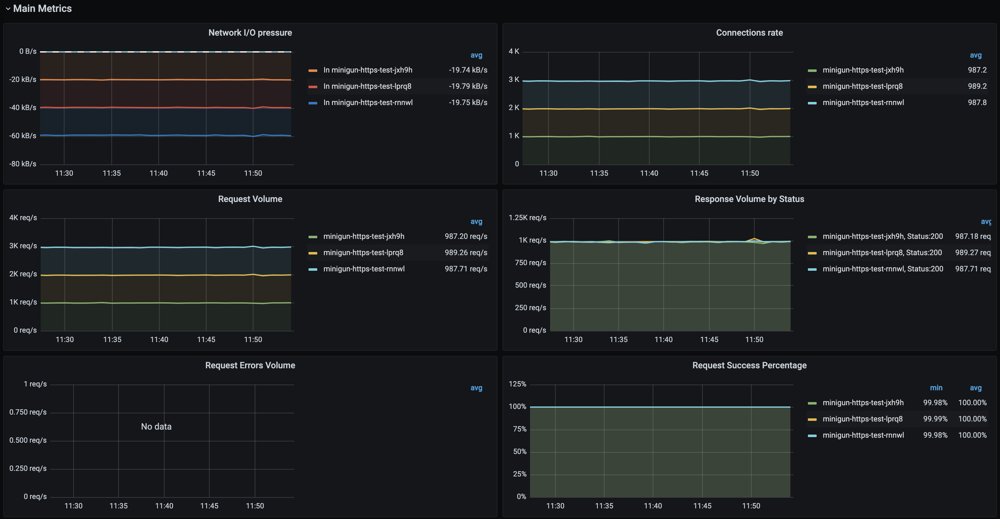
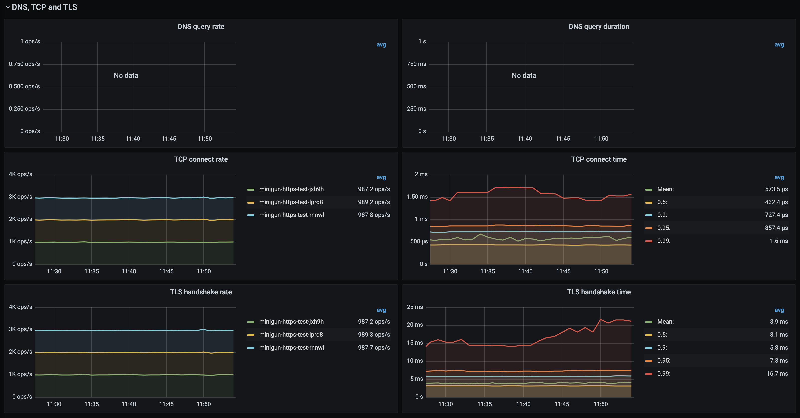

# Minigun

[](https://github.com/wayfair-incubator/minigun/blob/main/CHANGELOG.md)
[](CODE_OF_CONDUCT.md)

## About The Project

Minigun is a highly performant Kubernetes native HTTP benchmark tool written in Go.
Besides providing a text or JSON report, it exposes metrics in Prometheus format,
which could be scraped from the Minigun's `/metrics` endpoint or pushed to the
Prometheus Push Gateway.

It can be run as a CLI tool on any supported system to run a benchmark, as a Pod inside
Kubernetes cluster to constantly provide performance metrics, or as a one time Job.

## Getting Started

Binary:

1. Download a tarball from the [releases](https://github.com/wayfair-incubator/minigun/releases) page.
1. Unpack it, example for Linux binary: `tar xzf minigun-linux64.tgz`
1. Run it: `./minigun -h`

Docker image:

1. Check [available docker image tags](https://github.com/wayfair-incubator/minigun/pkgs/container/minigun/versions)
1. Download the image: `docker pull ghcr.io/wayfair-incubator/minigun:latest`
1. Run it: `docker run --rm ghcr.io/wayfair-incubator/minigun:latest -h`

## Usage

### Simple examples

Running a test with 50 reqs/sec rate for 30 seconds and sending 5Kb body via `POST`:

```sh
minigun \
  -fire-target http://kube-echo-perf-test.test.cluster.local/echo/2 \
  -send-method POST -random-body-size 5Kb \
  -fire-rate 50 -workers 20 -fire-duration 30s
```

Result:

```plain text
Starting benchmark
Benchmark is running.
Benchmark is complete.

Target:                              http://kube-echo-perf-test.test.cluster.local/echo/2
Method:                              POST
Duration:                            30.00 seconds
Max concurrency:                     20
Request body size:                   5.0 kB

Completed requests:                  1517
Succeeded requests:                  1517
Failed requests:                     0
Requests per second:                 50.57 (mean, across all concurrent requests)
Transfer rate (HTTP Message Body)    319 kB/s sent (mean)
                                     253 kB/s sent (mean, across all concurrent requests)
                                     637 kB/s received (mean)
                                     506 kB/s received (mean, across all concurrent requests)
DNS queries                          20
TCP connections                      20
HTTP status codes                    [200:1517]

                           MEAN       MEDIAN      P90        P95        P99
Full request duration      15.69ms    15.74ms     16.70ms    16.86ms    31.42ms
DNS request duration       3.46ms     742.81µs    17.48ms    19.31ms    19.39ms
TCP connection duration    14.28ms    14.30ms     15.10ms    15.30ms    15.86ms
HTTP write request body    41.12µs    39.05µs     50.61µs    56.17µs    76.90µs
HTTP time to first byte    15.61ms    15.65ms     16.63ms    16.78ms    31.36ms
HTTP response duration     15.34ms    15.59ms     16.56ms    16.70ms    17.34ms
```

Running a test via HTTPS with custom `Host` header and interrupting it in the middle:

```sh
minigun \
  -insecure -fire-target https://10.10.10.10/echo/2 \
  -http-header Host:kube-echo-perf-test.test.cluster.local \
  -send-method POST -random-body-size 5Kb \
  -fire-rate 20 -workers 20 -fire-duration 30s
```

Result:

```plain text
Starting benchmark
Benchmark is running.
^C
Received signal: interrupt
Benchmark is complete.

Target:                              https://10.10.10.10/echo/2
Method:                              POST
Duration:                            10.96 seconds
Max concurrency:                     20
Request body size:                   5.0 kB

Completed requests:                  222
Succeeded requests:                  222
Failed requests:                     0
Requests per second:                 20.25 (mean, across all concurrent requests)
Transfer rate (HTTP Message Body)    279 kB/s sent (mean)
                                     101 kB/s sent (mean, across all concurrent requests)
                                     558 kB/s received (mean)
                                     202 kB/s received (mean, across all concurrent requests)
TCP connections                      20
TLS Handshakes                       20
HTTP status codes                    [200:222]

                           MEAN       MEDIAN     P90        P95        P99
Full request duration      17.94ms    15.43ms    17.01ms    44.79ms    48.32ms
TCP connection duration    13.86ms    13.94ms    14.82ms    15.04ms    15.11ms
TLS handshake duration     16.04ms    15.99ms    17.01ms    17.16ms    21.86ms
HTTP write request body    69.15µs    62.11µs    81.12µs    87.90µs    126.59µs
HTTP time to first byte    17.85ms    15.35ms    16.92ms    44.71ms    48.23ms
HTTP response duration     15.06ms    15.20ms    16.13ms    16.32ms    17.02ms
```

Since we're using IP address and `https://` scheme in this second example, please note
that DNS metrics are no longer reported but instead we have new TLS related metrics.

One more example for JSON report:

```sh
minigun \
  -fire-target http://kube-echo-perf-test.test.cluster.local/ \
  -fire-rate 50 -workers 20 -fire-duration 15s -report json | jq '.RequestsCompleted'

759
```

### Pushing metrics to Prometheus Pushgateway

In this example we're running Minigun on one of the Kubernettes nodes and we're pushing
metrics to the Prometheus Pushgateway endpoint (ClusterIP Kubernetes service)

```sh
minigun \
  -fire-target http://kube-echo-perf-test.test.cluster.local/echo/2 \
  -fire-rate 20 -fire-duration 10m -insecure -workers 20 \
  -disable-keep-alive -send-method POST -random-body-size 1Kb \
  -push-gateway http://192.168.0.1:9091 -name ssl-test
```

Please note that you can add `-name YOUR_NAME_HERE` argument to set custom `name`
label value for metrics exported to Prometheus. This could be useful to separate your
test metrics from others.

### Grafana Dashboard

Chart examples from [Minigun Grafana dashboard](grafana/Minigun.json):



Please note that this dashboard was designed for a multi-cluster environment in which
every cluster has a unique `cluster_name` label on every metric, which is implemented
via Prometheus `global.external_labels` [config option](https://prometheus.io/docs/prometheus/latest/configuration/configuration/).

## Understanding report

You can read detailed explanation of reported metrics by using CLI help:

```sh
minigun -report-help
```

Or by checking the [following documentation page](./docs/report-help.md)

## Local Development

### Prerequisites

This is an example of how to list things you need to use the software and how to install them.

- Docker for image build.
- Golang 1.17 for local binary build.

### Building a Docker image

```sh
docker-compose build
```

or

```sh
docker build .
```

### Building a local binary

If you want to `go run` or build locally with your system Golang instead of docker,
you need to do this:

1. Put this app  directory to your `$GOPATH` (if env is not set you can check with `go env`):

   ```sh
   cp -a ./  ~/go/src/github.com/wayfair-incubator/minigun
   ```

1. Go to your working directory:

   ```sh
   cd ~/go/src/github.com/wayfair-incubator/minigun
   ```

1. Edit files.

1. Create vendor to speed up re-builds (it will be also used if you build in Docker):

   ```sh
   make get-deps
   ```

1. Build binary for your local OS:

   ```sh
   make local-build
   ```

1. Run it:

   ```sh
   ./minigun -h
   ```

## Roadmap

See the [open issues](https://github.com/wayfair-incubator/minigun/issues) for a list of proposed features (and known issues).

## Release Management

- Push changes via Github Pull Requests, review and merge them.
- Change the version constant in the `main.go` file.
- Add all changes introduced since the last release to the `CHANGELOG.md` file.
- When the new release is ready, [draft a new release](https://github.com/wayfair-incubator/minigun/releases/new):
  - Make sure to specify a new tag, make sure to follow [SemVer spec](https://semver.org/spec/v2.0.0.html).
- Publish the new release.
- All artifacts should be published automatically shortly after the new release is published.

## Contributing

Contributions are what make the open source community such an amazing place to learn, inspire, and create. Any contributions you make are **greatly appreciated**. For detailed contributing guidelines, please see [CONTRIBUTING.md](CONTRIBUTING.md)

## License

Distributed under the `MIT` License. See `LICENSE` for more information.

## Contact

Alexander Didenko - [@adidenko](https://github.com/adidenko)

Project Link: [https://github.com/wayfair-incubator/minigun](https://github.com/wayfair-incubator/minigun)

## Acknowledgements

This template was adapted from
[https://github.com/othneildrew/Best-README-Template](https://github.com/othneildrew/Best-README-Template).
