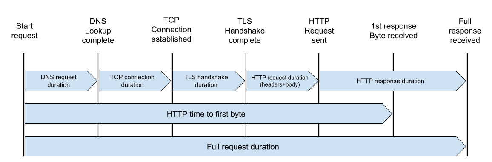

# Report explained

## Diagram

[](images/minigun-metrics.svg)

## Metrics

```plain text
METRIC                     EXPLANATION
Full request duration      Full time of a request starting from the beginning (DNS lookup) and ending with receiving a full response.
DNS request duration       The time spent on DNS lookup.
TCP connection duration    The time spent on establishing TCP connection using a TCP handshake.
TLS handshake duration     The time spent on TLS handshake.
HTTP write request body    The time required to write request body to the remote endpoint.
HTTP time to first byte    The time since the request start and when the first byte of HTTP reply from the remote endpoint is received. This time includes DNS lookup, establishing the TCP connection and SSL handshake if the request is made over https.
HTTP response duration     The time since request headers and body are sent and until the full response is received.
```

You can get these details by running `minigun -report-help`.

## Explaining how across all concurrent requests works

Here's an example of Minigun report and some explanations for the metrics it shows.

Command:

```sh
minigun -fire-target http://kube-echo-perf-test.test.cluster.local/echo/1 \
  -random-body-size 1KB \
  -fire-rate 10 \
  -workers 5 \
  -fire-duration 1m \
  -ab-time-per-request
```

Result:

```plain text
Starting benchmark
Benchmark is running.
Benchmark is complete.

Target:                              http://kube-echo-perf-test.test.cluster.local/echo/1
Method:                              GET
Duration:                            60.00 seconds
Max concurrency:                     5
Request body size:                   1.0 kB

Completed requests:                  599
Succeeded requests:                  599
Failed requests:                     0
Requests per second:                 9.98 (mean, across all concurrent requests)
Time per request                     1.81ms (mean)
Time per request                     100.17ms (mean, across all concurrent requests)
Transfer rate (HTTP Message Body)    552 kB/s sent (mean)
                                     10 kB/s sent (mean, across all concurrent requests)
                                     552 kB/s received (mean)
                                     10 kB/s received (mean, across all concurrent requests)
DNS queries                          20
TCP connections                      20
TLS Handshakes                       10
HTTP status codes                    [200:599]

                           MEAN        MEDIAN      P90         P95         P99
Full request duration      1.81ms      1.39ms      1.94ms      2.91ms      10.33ms
DNS request duration       1.83ms      575.92µs    2.08ms      3.40ms      17.82ms
TCP connection duration    363.75µs    178.26µs    233.97µs    338.52µs    3.69ms
TLS handshake duration     6.66ms      4.41ms      5.11ms      28.51ms     28.51ms
HTTP write request body    7.72µs      6.98µs      12.37µs     13.25µs     24.86µs
HTTP receive first byte    1.13ms      1.10ms      1.56ms      1.94ms      8.27ms
HTTP response duration     1.03ms      831.62µs    1.21ms      1.48ms      6.72ms
```

There're some metrics with `(mean, across all concurrent requests)` which show different
numbers than the same metric with `(mean)`. The `across all concurrent requests` comment
means it's **an average number for the entire benchmark run**. While `(mean)` is an **average
of per worker metrics**.

So in the example above we're running 5 workers with desired request rate 10 reqs/s:

- `Time per request 1.81ms (mean)` - every worker calculates exact time it takes
  to process the HTTP request. And this is the average of all the workers' metrics.
- `Time per request 100.17ms (mean, across all concurrent requests)` - we're running
  10 requests per second from 5 workers, and since every worker can complete this request
  in `~1.81ms`, then we're not constrained by the app performance and can do 10 reqs/s
  exactly. Simple math shows that expected request time is `1 second / 10 requests`
  which is `1000 ms / 10 = 100 ms`. Which is almost exactly what we get here (`100.17ms`).

Let's also take a look at `Transfer rate (HTTP Message Body)`:

- `552 kB/s sent (mean)` - every worker calculates number of bytes of HTTP body it sends
  and exact time required to send them. So this metric shows average `Bytes / second` for
  all workers.
- `10 kB/s sent (mean, across all concurrent requests)` - this is average across all workers
  and for the benchmark duration. We're sending `1.0 kB` request body at `10 reqs/s` rate
  which is in total `10 kB/s` across all concurrent requests during benchmark duration.
